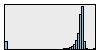
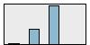
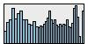
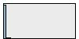
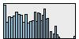
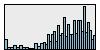
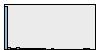
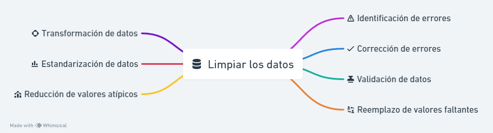
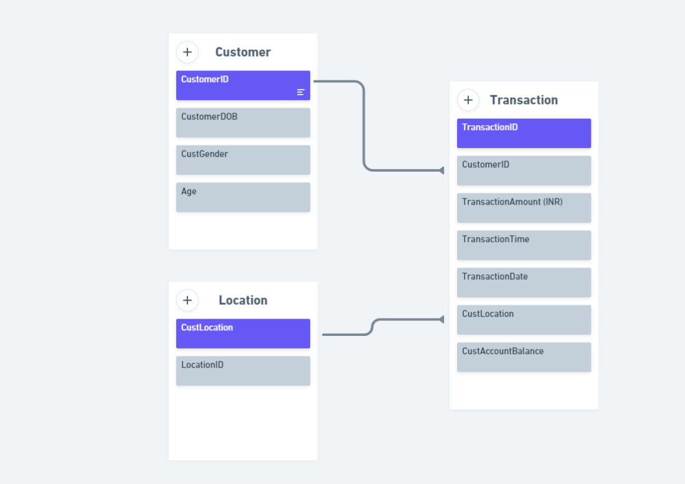

# Prueba Técnica

## Paso 1: Alcance del proyecto y captura de datos
 
Los datos que se van a utilizar en este proyecto "bank_transactions.csv", encontrados en los datasets de kaggle, contiene
datos reales de transacciones de clientes de una institución bancaria de la India del 2016, donde cada instancia (fila) 
del archivo corresponde a una transacción individual. Incluye datos sobre la transacción, el monto, la fecha y hora, 
el saldo del cliente, y el ID de la transacción; sobre el cliente, la fecha de nacimiento,el genero y su ID; y la 
localización donde se hizo la transacción.

Estos datos se van a utilizar con el objetivo de segmentar para identificar grupos comunes en estos registros de la 
información, esto se hará analizando los datos de transacciones de los clientes para identificar patrones y tendencias.
Una vez que los clientes se hayan segmentado, el banco podrá utilizar esta información para mejorar su marketing, 
sus productos y sus servicios, hasta para encontrar perfiles con tendencias al fraude.

## Paso 2: Explorar y evaluar los datos, el EDA

### Análisis de calidad de datos.

**Auditoría de datos de 9 campos y 1'048.567 registros**

Se construyé una auditoría de datos a partir de la herramienta de SPSS Modeler.
Se encuentra una base de datos con un millon cuarenta y ocho mil quinientos sesenta y siete registros con 9 variables, 
de las cuales 4 son variables númericas, 1 de fecha y 4 categoricas, las variables de ID de cliente, ID de transacción, 
fecha, hora y monto de la transacción traen valores válidos para cada uno de los registros, mientras que las variables de
fecha de nacimiento , genero, ubicación y saldo del cliente, no estan completos cada uno esta con un porcentaje del 99 %
aproximado de completitud, lo que nos genera una completitud del 99,34 % a nivel de filas y 42,86 % a nivel de columnas,
esto es común en archivos transaccionales dado que la información se exporta a partir de un software transaccional que 
construye toda la información y no genera perdida de información, donde hay perdida de información es en las variables 
relacionadas a la información del cliente por lo que existe la posibilidad de que exitan esos datos faltantes.

Para cada una de las variables se genera los descriptivos siempre y cuando sean variables numericas y esto es consistente
para el tipo de dato,también se construye los graficos de distribución para las variables, histogramas para las numéricas
y de barras para las categoricas, en la tabla Auditoría de datos.

**Auditoría de datos de 7 campos**

|     |     |     |     |     |     |     |     |     |     |     |     |     |     |     |     |     |     |     |     |
| --- | --- | --- | --- | --- | --- | --- | --- | --- | --- | --- | --- | --- | --- | --- | --- | --- | --- | --- | --- |
|     | Campo | Gráfico de muestras | Medida | Mín. | Máx. | Suma | Rango | Media | Error estándar de media | Desv. estándar | Varianza | Sesgo | Err. típ. de asimetría | Kurtosis | Err. típ. de Kurtosis | Mediana | Modo | Exclusivo | Válido |
| 1   | CustomerDOB |  | Continuo | 1800-01-01 | 2029-12-19 | --  | 7256995200.000 | --  | --  | --  | --  | --  | --  | --  | --  | 1987-03-30 | 1800-01-01 | --  | 1045170 |
| 2   | CustGender |   | Nominal | --  | --  | --  | --  | --  | --  | --  | --  | --  | --  | --  | --  | --  | M   | 4   | 1047467 |
| 3   | CustLocation |  | Nominal | --  | --  | --  | --  | --  | --  | --  | --  | --  | --  | --  | --  | --  | MUMBAI | 9356 | 1048416 |
| 4   | CustAccountBalance |   | Continuo | 0.000 | 115035495.100 | 120734952799.741 | 115035495.100 | 115403.540 | 827.585 | 846485.381 | 716537499570.673 | 60.530 | 0.002 | 5830.087 | 0.005 | 16792.180 | 0.000 | --  | 1046198 |
| 5   | TransactionDate |   | Continuo | 2016-08-01 | 2016-10-21 | --  | 6998400.000 | --  | --  | --  | --  | --  | --  | --  | --  | 2016-08-25 | 2016-08-07 | --  | 1048567 |
| 6   | TransactionTime |   | Continuo | 0   | 235959 | 164716799433 | 235959 | 157087.529 | 50.061 | 51261.854 | 2627777677.807 | -0.837 | 0.002 | 0.476 | 0.005 | 164226 | 193303¹ | --  | 1048567 |
| 7   | TransactionAmount (INR) |   | Continuo | 0.000 | 1560034.990 | 1650795731.570 | 1560034.990 | 1574.335 | 6.421 | 6574.743 | 43227245.233 | 47.337 | 0.002 | 6641.979 | 0.005 | 459.030 | 100.000 | --  | 1048567 |

Se genera la cantidad de valores atipicos y extremos, la completitud de los campos y de que tipo es el dato que esta
perdido, para las variables que no están 100 % completas.

**Calidad de datos de 7 campos**

|     |     |     |     |     |     |     |     |     |     |     |
| --- | --- | --- | --- | --- | --- | --- | --- | --- | --- | --- |
|     | Campo | Medida | Valores atípicos | Extremos | % Completo | Registros válidos | Valor nulo | Cadena vacía | Espacio en blanco | Valor en blanco |
| 1   | CustomerDOB | Continuo | 0   | 0   | 99,676 | 1045170 | 3397 | 0   | 0   | 0   |
| 2   | CustGender | Nominal | --  | --  | 99,895 | 1047467 | 0   | 1100 | 1100 | 0   |
| 3   | CustLocation | Nominal | --  | --  | 99,986 | 1048416 | 0   | 151 | 151 | 0   |
| 4   | CustAccountBalance | Continuo | 2548 | 2561 | 99,774 | 1046198 | 2369 | 0   | 0   | 0   |
| 5   | TransactionDate | Continuo | 0   | 0   | 100,000 | 1048567 | 0   | 0   | 0   | 0   |
| 6   | TransactionTime | Continuo | 11259 | 0   | 100,000 | 1048567 | 0   | 0   | 0   | 0   |
| 7   | TransactionAmount (INR) | Continuo | 4745 | 4772 | 100,000 | 1048567 | 0   | 0   | 0   | 0   |

Para la limpieza de datos el primer paso es identificar los errores en el conjunto de datos. Esto se puede hacer mediante
visualizaciones de los datos, utilizando herramientas de análisis de datos o utilizando un conjunto de reglas para 
identificar errores específicos. Una vez que se han identificado los errores, deben corregirse. Esto implicaría la edición,
la eliminación de los datos o la creación de nuevos datos.

Para esta base de datos fue necesario hacer una selección con los registros validos, eliminando aquellos que el genero era "T"
y las anomalias en la edad, los valores faltantes pueden ser reemplazados por la media, la mediana o la moda del conjunto de datos; luego se debe hacer una reducción 
de valores atípicos, los valores atípicos son valores que se desvían significativamente del resto de los datos y pueden 
eliminarse o reemplazarse por valores cercanos; también se debe hacer una estandarización de datos para que todos los 
valores estén en la misma escala y esto pueda facilitar el análisis de los datos; los datos pueden ser transformados 
para que sean más fáciles de analizar, los datos categóricos pueden ser convertidos en datos numéricos.

Como paso final, después de corregir los errores, los datos deben validarse para asegurarse de que están limpios. Esto 
se puede hacer con las técnicas utilizadas en el primer paso.

## Paso 3: Definir el modelo de datos

