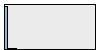
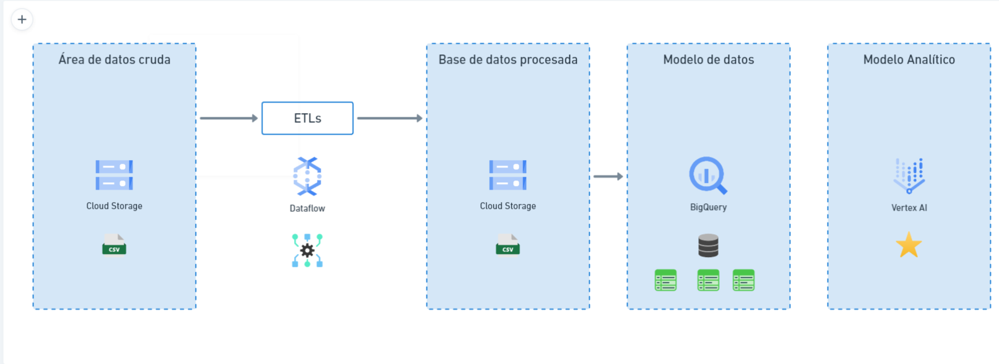

# Prueba Técnica

## Paso 1: Alcance del proyecto y captura de datos
 
Los datos que se van a utilizar en este proyecto "bank_transactions.csv", encontrados en los datasets de kaggle, contiene
datos reales de transacciones de clientes de una institución bancaria de la India del 2016, donde cada instancia (fila) 
del archivo corresponde a una transacción individual. Incluye datos sobre la transacción, el monto, la fecha y hora, 
el saldo del cliente, y el ID de la transacción; sobre el cliente, la fecha de nacimiento, el género y su ID; y la 
localización donde se hizo la transacción.

Estos datos se van a utilizar con el objetivo de segmentar para identificar grupos comunes en estos registros de la 
información, esto se hará analizando los datos de transacciones de los clientes para identificar patrones y tendencias.
Una vez que los clientes se hayan segmentado, el banco podrá utilizar esta información para mejorar su marketing, 
sus productos y sus servicios, hasta para encontrar perfiles con tendencias al fraude.

## Paso 2: Explorar y evaluar los datos, el EDA

### Análisis de calidad de datos.

**Auditoría de datos de 9 campos y 1'048.567 registros**

Se construyé una auditoría de datos a partir de la herramienta de SPSS Modeler.
Se encuentra una base de datos con un millón cuarenta y ocho mil quinientos sesenta y siete registros con 9 variables, 
de las cuales 4 son variables numéricas, 1 de fecha y 4 categóricas, las variables de ID de cliente, ID de transacción, 
fecha, hora y monto de la transacción traen valores válidos para cada uno de los registros, mientras que las variables de
fecha de nacimiento, género, ubicación y saldo del cliente, no están completos cada uno está con un porcentaje del 99 %
aproximado de completitud, lo que nos genera una completitud del 99,34 % en filas y 42,86 % en columnas,
esto es común en archivos transaccionales dado que la información se exporta a partir de un software transaccional que 
construye toda la información y no genera perdida de información, donde hay perdida de información es en las variables 
relacionadas con la información del cliente por lo que existe la posibilidad de que existan esos datos faltantes.

Para cada una de las variables se genera los descriptivos siempre y cuando sean variables numéricas y esto es consistente
para el tipo de dato, también se construye los gráficos de distribución para las variables, histogramas para las numéricas
y de barras para las categóricas, en la tabla Auditoría de datos.

**Auditoría de datos de 7 campos**

|   |                         |                         |              |              |               |                  |                |            |                         |                     |                  |           |                        |          |                       |            |            |           |         |
|---|-------------------------|-------------------------|--------------|--------------|---------------|------------------|----------------|------------|-------------------------|---------------------|------------------|-----------|------------------------|----------|-----------------------|------------|------------|-----------|---------|
|   | Campo                   | Gráfico de muestras     | Medida       | Mín.         | Máx.          | Suma             | Rango          | Media      | Error estándar de media | Desviación estándar | Varianza         | Asimetría | Err. típ. de asimetría | Kurtosis | Err. típ. de Kurtosis | Mediana    | Modo       | Exclusivo | Válido  |
| 1 | CustomerDOB             |  | Continuo     | 1800-01-01   | 2029-12-19    | --               | 7256995200.000 | --         | --                      | --                  | --               | --        | --                     | --       | --                    | 1987-03-30 | 1800-01-01 | --        | 1045170 |
| 2 | CustGender              |  | Nominal      | --           | --            | --               | --             | --         | --                      | --                  | --               | --        | --                     | --       | --                    | --         | M          | 4         | 1047467 |
| 3 | CustLocation            |  | Nominal      | --           | --            | --               | --             | --         | --                      | --                  | --               | --        | --                     | --       | --                    | --         | MUMBAI     | 9356      | 1048416 |
| 4 | CustAccountBalance      |  | Continuo     | 0.000        | 115035495.100 | 120734952799.741 | 115035495.100  | 115403.540 | 827.585                 | 846485.381          | 716537499570.673 | 60.530    | 0.002                  | 5830.087 | 0.005                 | 16792.180  | 0.000      | --        | 1046198 |
| 5 | TransactionDate         |  | Continuo     | 2016-08-01   | 2016-10-21    | --               | 6998400.000    | --         | --                      | --                  | --               | --        | --                     | --       | --                    | 2016-08-25 | 2016-08-07 | --        | 1048567 |
| 6 | TransactionTime         |  | Continuo     | 0            | 235959        | 164716799433     | 235959         | 157087.529 | 50.061                  | 51261.854           | 2627777677.807   | -0.837    | 0.002                  | 0.476    | 0.005                 | 164226     | 193303¹    | --        | 1048567 |
| 7 | TransactionAmount (INR) |  | Continuo     | 0.000        | 1560034.990   | 1650795731.570   | 1560034.990    | 1574.335   | 6.421                   | 6574.743            | 43227245.233     | 47.337    | 0.002                  | 6641.979 | 0.005                 | 459.030    | 100.000    | --        | 1048567 |

Se genera la cantidad de valores atípicos y extremos, la completitud de los campos y de qué tipo es el dato que está
perdido, para las variables que no están 100 % completas.

**Calidad de datos de 7 campos**

|   |                         |          |                  |          |            |                   |            |              |                   |                 |
|---|-------------------------|----------|------------------|----------|------------|-------------------|------------|--------------|-------------------|-----------------|
|   | Campo                   | Medida   | Valores atípicos | Extremos | % Completo | Registros válidos | Valor nulo | Cadena vacía | Espacio en blanco | Valor en blanco |
| 1 | CustomerDOB             | Continuo | 0                | 0        | 99,676     | 1045170           | 3397       | 0            | 0                 | 0               |
| 2 | CustGender              | Nominal  | --               | --       | 99,895     | 1047467           | 0          | 1100         | 1100              | 0               |
| 3 | CustLocation            | Nominal  | --               | --       | 99,986     | 1048416           | 0          | 151          | 151               | 0               |
| 4 | CustAccountBalance      | Continuo | 2548             | 2561     | 99,774     | 1046198           | 2369       | 0            | 0                 | 0               |
| 5 | TransactionDate         | Continuo | 0                | 0        | 100,000    | 1048567           | 0          | 0            | 0                 | 0               |
| 6 | TransactionTime         | Continuo | 11259            | 0        | 100,000    | 1048567           | 0          | 0            | 0                 | 0               |
| 7 | TransactionAmount (INR) | Continuo | 4745             | 4772     | 100,000    | 1048567           | 0          | 0            | 0                 | 0               |

Para la limpieza de datos el primer paso es identificar los errores en el conjunto de datos. Esto se puede hacer mediante
visualizaciones de los datos, utilizando herramientas de análisis de datos o utilizando un conjunto de reglas para 
identificar errores específicos. Una vez que se han identificado los errores, deben corregirse. Esto implicaría la edición,
la eliminación de los datos o la creación de nuevos datos.

Para esta base de datos fue necesario hacer una selección con los registros válidos, eliminando aquellos que el género 
era "T" y las anomalies en la edad, los valores faltantes pueden ser reemplazados por la media, la mediana o la moda del
conjunto de datos; luego se debe hacer una reducción de valores atípicos, los valores atípicos son valores que se desvían
significativamente del resto de los datos y pueden eliminarse o reemplazarse por valores cercanos; también se debe hacer
una estandarización de datos para que todos los valores estén en la misma escala y esto pueda facilitar el análisis de 
los datos; los datos pueden ser transformados para que sean más fáciles de analizar, los datos categóricos pueden ser 
convertidos en datos numéricos.

Como paso final, después de corregir los errores, los datos deben validarse para asegurarse de que están limpios. Esto 
se puede hacer con las técnicas utilizadas en el primer paso.

## Paso 3: Definir el modelo de datos

### Modelo de datos
Se divide el archivo principal en tres tablas, la primera "Clients" con la información relacionada con los clientes, la 
segunda "Location", con las ciudades donde se hicieron las transacciones y por último la tabla "Transactions", donde está
toda la información de la transacción. Estas tres entidades están relacionadas entre sí de varias maneras. Un cliente 
puede tener varias transacciones, y una ubicación puede tener varias transacciones.

Se elige este modelo de datos para poder seccionar la información, en el caso de las entidades "Customer", "Transaction"
y "Location", un modelo ER es una buena opción porque es fácil de entender y visualizar. También es una buena opción 
porque puede ser utilizado para representar una amplia gama de datos, incluyendo clientes, transacciones y ubicaciones.
Los modelos ER también son una buena opción porque son escalables

### Arquitectura

Para la arquitectura, se crean cuatro instancias en google cloud, dos de cloud storage para almacenar los datos crudos y 
los datos procesados por medio de dataflow, se construye el modelo de datos en BigQuery y por último se crea el modelo 
en un notebook de Jupyter, almacenándolo en los Kubernetes.

Se elige Google Cloud como plataforma en la nube para poner en desarrollo el proyecto porque ofrece una variedad de 
características que pueden ayudar a los científicos de datos y a los ingenieros a desarrollar, entrenar y desplegar 
modelos de Machine Learning; se hace uso de BigQuery que es un almacén de datos de análisis que puede almacenar y
procesar grandes cantidades de datos. GCP ofrece una integración con BigQuery que puede ayudar a los científicos de 
datos a analizar los datos de sus proyectos de Machine Learning; se usa Dataflow para las ETL, este es un servicio de 
procesamiento por lotes administrado de Google Cloud Platform que le permite procesar grandes cantidades de datos de 
forma rápida y confiable.

Los datos deben actualizarse cada seis meses para comprobar que el modelo siga estando vigente, si a lo largo del tiempo 
es notable que los resultados no tienen variación, se puede actualizar la data de manera anual, hasta que los resultados
sean diferentes, esto porque la población cambio diferencialmente su comportamiento con relación a las transacciones 
bancarias y se debe crear una versión nueva del modelo.

## Paso 4: Ejecutar la ETL

### Diccionario de datos
|   |                         |               |                                          |                    |                      | 
|---|-------------------------|---------------|------------------------------------------|--------------------|----------------------|
|   | Nombre de la columna	   | Tipo de datos | 	Descripción                             | 	Fuente	           | Ejemplos             | 
| 1 | TransactionID           | 	Entero       | 	Identificador único de la transacción   | 	bank_transactions | 	T1 , T2, T3         | 
| 2 | CustomerID              | 	Entero       | 	Identificador único del cliente         | 	bank_transactions | 	C1234567, C1111111	 | 
| 3 | CustomerDOB             | 	Fecha        | 	Fecha de nacimiento del cliente         | 	bank_transactions | 	4/4/57, 26/11/96    |
| 4 | CustGender              | 	Cadena       | 	Género del cliente                      | 	bank_transactions | 	F:female, M:male    | 
| 5 | CustLocation	           | Cadena        | 	Ubicación del cliente                   | 	bank_transactions | 	JHAJJAR , MUMBAI    | 
| 6 | TransactionDate         | 	Fecha        | 	Fecha de la transacción                 | 	bank_transactions | 	2/8/16, 20/6/20     | 
| 7 | TransactionTime         | 	Tiempo       | 	Hora de la transacción                  | 	bank_transactions | 	143207	, 123456     | 
| 8 | TransactionAmount (INR) | 	Decimal	     | Monto de la transacción en rupias indias | bank_transactions  | 	1000.1, 54.2, 10    |

## Paso 5: Completar la redacción del proyecto

A partir dela recopilación datos de transacciones de clientes para identificar patrones y tendencias. Estos datos se 
utilizarán para segmentar a los clientes en grupos con características comunes. Una vez que los clientes estén 
segmentados, el banco podrá utilizar esta información para mejorar su marketing, productos y servicios. También se 
pueden utilizar para identificar perfiles con tendencias al fraude.

Las preguntas que quiero hacer son:
1. ¿Qué datos se recopilarán?
2. ¿Cómo se analizarán los datos?
3. ¿Cómo se segmentarán los clientes?
4. ¿Cómo se utilizarán los datos para mejorar el marketing, los productos y los servicios?
5. ¿Cómo se utilizarán los datos para identificar perfiles con tendencias al fraude?

También me gustaría saber más sobre los objetivos específicos del proyecto de segmentación. ¿Qué se espera lograr con 
este proyecto? ¿Cómo esperan que los datos les ayuden a alcanzar sus objetivos? Creo que es importante comprender los 
objetivos del proyecto de segmentación antes de comenzar a recopilar y analizar datos. Esto asegurará que los datos se 
recopilen y analicen de una manera que sea relevante para los objetivos del proyecto.

También creo que es importante tener en cuenta la privacidad de los clientes cuando se recopilan y analizan datos, se 
debe asegurarse de que los datos se recopilan y se utilizan de una manera que respete la privacidad de los clientes.
En general, creo que este proyecto de segmentación tiene el potencial de ser muy beneficioso para un banco. Al recopilar
y analizar datos, el banco puede mejorar su marketing, productos y servicios. También puede identificar perfiles con 
tendencias al fraude y tomar medidas para prevenir el fraude.

El algoritmo K-Means es un algoritmo de agrupación no supervisado que se utiliza para agrupar datos similares en grupos,
el algoritmo funciona asignando cada punto de datos al grupo más cercano, según la distancia entre los puntos de datos y
los centroides de los grupos.

K-Means es una buena opción para la segmentación porque es fácil de entender y usar; también es rápido y eficiente, lo 
que lo hace ideal para trabajar con grandes conjuntos de datos. Además, K-Means es versátil y se puede utilizar para 
segmentar datos de una variedad de fuentes, incluidos datos de encuestas, datos de transacciones y datos de redes sociales.

En general, K-Means es una buena opción para la segmentación de datos. Es fácil de entender y usar, rápido y eficiente, 
y versátil.

### Como abordar el problema si:
#### Los datos se incrementaran en 100x

Una opción es utilizar un algoritmo de Machine Learning diferente que pueda manejar grandes conjuntos de datos, otra 
opción es utilizar una engine de google cloud más potente que pueda procesar los datos más rápidamente, agregando 
pipelines a los procesos de ETL, Otra opción es utilizar el servicio Cloud Machine Learning Engine, que es un servicio
que puede ayudar a los científicos de datos a entrenar y desplegar modelos de aprendizaje automático sin tener que 
administrar sus propios servidores, se puede utilizar Cloud Dataflow para procesar los datos en paralelo, se puede 
utilizar Cloud Dataproc para ejecutar trabajos de análisis de datos, se puede utilizar Cloud Data Fusion para integrar 
fuentes de datos dispares.
#### Las tuberías se ejecutarán diariamente en una ventana de tiempo específica

Se debe implementar un evento programado con un clúster específico para la ejecución de tuberías en Google Cloud, el 
proceso es primero, configurar un clúster en Cloud Dataproc y definir un trabajo asociado; luego, en la 
sección "Configuración del trabajo", acceder a la pestaña "Programación" y establecer la frecuencia y horario del trabajo.
A continuación, especificar el clúster designado para la tarea y confirmar la creación. De esta manera, el trabajo 
se llevará a cabo según lo programado. Además, es posible aprovechar estos eventos programados para distintos propósitos,
como extraer y cargar datos desde una fuente hasta un repositorio, procesar datos y generar informes, o incluso crear 
modelos de aprendizaje automático. La automatización mediante eventos programados simplifica la ejecución de las 
tuberías en Google Cloud, ahorrando tiempo y esfuerzo, a la vez que garantiza una consistencia y confiabilidad en el proceso.

#### La base de datos necesitará ser accedido por más de 100 usuarios funcionales

Se puede utilizar Cloud SQL, que es un servicio completamente administrado que puede alojar bases de datos MySQL, 
PostgresSQL y SQL Server. Cloud SQL puede ayudar a garantizar que las bases de datos sean accesibles y confiables, 
incluso si hay un gran número de usuarios; otra opción es utilizar Cloud Spanner, que es un servicio de base de datos de
esquema múltiple y distribución global que puede proporcionar alta disponibilidad y escalabilidad. Cloud Spanner puede 
ayudar a garantizar que las bases de datos sean accesibles y confiables, incluso si hay un gran número de usuarios y si 
los datos se almacenan en varias regiones; también se puede utilizar Cloud Bigtable, que es un servicio de base de datos
de nodo múltiple y escalado horizontalmente que puede proporcionar alta disponibilidad y escalabilidad. Cloud Bigtable 
puede ayudar a garantizar que las bases de datos sean accesibles y confiables, incluso si hay un gran número de usuarios
y si los datos se almacenan en varios centros de datos. Si el proyecto requiere el acceso a una base de datos relacional,
entonces Cloud SQL o Cloud Spanner pueden ser mejores opciones. Si el proyecto requiere el acceso a una base de datos 
NoSQL, entonces Cloud Bigtable puede ser una mejor opción.

#### Se requiere hacer analítica en tiempo real, ¿Cuáles componentes cambiarios a su arquitectura propuesta?

Se puede utilizar Google Pub/Sub para transmitir los datos desde la fuente a la base de datos, Cloud Dataflow para 
procesar los datos, Cloud Bigtable para almacenar los datos, Cloud Dataproc para ejecutar trabajos de análisis de datos 
en tiempo real. Para consumir la información se puede construir un Dashboard, que se alimente de la información desde google
cloud platform y tenga actualización programada cada pocos minutos o segundos para tener la información en tiempo real. 